[Back to home](index.md)

# Final Report

## Introduction

Soccer is the most popular sport in the world, with an estimated 240 million registered players worldwide, and there is undoubtedly a lot of data present (Terrell, 2022).

Sports forecasting has been dominated by traditional statistical methods, but machine learning methods have emerged. Recent models used for sports forecasting are neural networks (Horvat & Job, 2020), such as Hubáček et. al. who use a convolutional neural network on an NBA dataset (Hubáček et al., 2019), although other researchers use regression models (e.g. linear, logistic), or support vector machines (Wilkens, 2021).

We will be using the [European Soccer Database](https://www.kaggle.com/datasets/hugomathien/soccer/data) by Hugo Mathien from Kaggle. We are interested in the following tables:
* __Match__:
This table contains features from over 25,000 matches played in Europe from 2008 to 2016. This dataset contains match statistics (e.g. number of cards, lineups, etc.) and betting odds from 10 providers. Betting odds will be important in our models when validating results.
* __Player_attributes__:
This table contains features such as player’s ratings in different attributes from the FIFA video game series, as well as height, weight, preferred foot, and age.
* __Team_attributes__:
This table contains features that rate teams in different aspects of the game, such as passing, dribbling, etc.

## Problem Definition

The sports betting industry is valued at 81 billion US dollars in the year 2022, and it is projected to double that by 2030. A critical piece of this industry is the spreads and odds that are bet on. For example, if the sportsbook which controls the betting odds expects Team A to beat team B by 3.5 points, if you bet on team A and they win by 4+ points then you win, else you lose, even if they win by 2 points. These spreads are essential to making money on betting, so we will use machine learning to create our own soccer game spreads, and identify which teams are overvalued and undervalued. As a first step, we will train ML models to predict match outcomes based on various feature sets.

__Disclaimer__: Online sports betting is illegal in the state of Georgia, and betting odds data are gathered from an open source database on Kaggle.

## Data Collection

We created three sets of features to train our various classifier models with:
1. Betting odds
2. Team-based attributes
3. Player-based attributes

To create these features, we had to generate features to encode match-ups between two teams. The Match data table contains betting odds from 10 providers, which already encode a match up by providing the odds of home team win, away team win, or draw For the remaining features, we computed match-up metrics using team-based and player-based ratings from the FIFA video game series. For example, for team attributes from the FIFA video game series sourced from the Team_attributes table, we computed the difference in home team metric with away team metric, and performed various aggregations (min, max, mean, median) on the features before associating them with their matches in the Match table. An example of one attribute we computed is average overall player FIFA rating per team. We then take the difference in average overall player FIFA rating from the home team and away team, and use that as the training feature.

The binary classification problem used “home team wins” as the positive label (1), and “home team draw/lose” as the negative label (0). Our dataset contained home team goals and away team goals, so we created our label accordingly – 1 if home team goals - away team goals > 0, 0 otherwise.

## Methods

Researchers have used many different machine learning algorithms to predict sports outcomes. We will use three models in this project:
1. Logistic Regression
2. Random Forest
3. Artificial Neural Network

Logistic regression models not only can be used for win/loss classification, but also give confidence in the model's decision. A random forest approach achieved an impressive 83% accuracy, and other random forest or decision tree models also outperformed regression based models (Wilkens, 2021). Lastly, artificial neural networks have shown strong results and require less preprocessing on inputs than other models (Hubáček et al., 2019).

We have trained our models on our various feature sets defined in the data collection. Each time we train the model, we perform a random sampling to generate our train dataset and test dataset. Our logistic regression models utilized a 90% train / 10% test split on the Match data table. The main data table contains ~26000 data points, so a 90% train / 10% split would result in ~23400 training records and ~2600 testing records. We handled missing values by dropping rows containing them, so our resulting training data would have less entries.

### Logistic Regression Methods
We trained various logistic regression models on three different sets of features: betting odds, match based matchup features, and player based matchup features. We used Scikit-Learn’s Logistic Regression Model instance using Newton-Cholesky and Saga solvers to optimize the parameters (scikit-learn developers, 2014).

For the betting odds and team attribute based features, the following methodology was used as a baseline:
1. Generate features
2. Perform train/test split
3. Train model on all features using training dataset
4. Evaluate feature importance
5. Determine top $k$ features based on importance which minimize test error and retrain
6. Evaluate performance and accuracy

The feature importance was evaluated using Permutation Feature Importance. The permutation feature importance metric randomly shuffles individual features one-by-one and measures the variation in the evaluation score. The features with higher variation are more important, while features with lower variation are less important (scikit-learn developers, n.d.). Additional steps were performed in some other sections.

### Random Forest Methods
We trained Random Forest models also on different sets of features: betting odds, team attributes, and build up stats. We used Scikit_Learn’s Random Forest Model instance to be able to predict outcomes of matches based on these different features.

This is the main process we followed to obtain a measurement of the likelihood of the home team winning:
Generate features
Perform train/test split
Train model using the training dataset
Obtain accuracy/score
Optimize Hyperparameters
Determine most important features and test model using just those features
For betting odds and team attributes, we were able to prevent overfitting of the data by fine tuning the hyperparameters such as a depth limit and a limit to n_estimators in an attempt to increase the accuracy of the trees. 

### Neural Network Methods
**WIP**

## Results and Discussion

As a rule of thumb, we will target 60% accuracy for rankings, as there is a very high degree of unpredictability in sports due to the obvious _human factor_. We shoot for a “more likely than not” heuristic for our predictions, which would give the model’s user an edge in closer matchups. For example, any rational fan of the beautiful game would predict with near 100% accuracy that a 2008-2009 season Barcelona FC squad would defeat a bottom-of-the-table 2023 MLS team. ML predictions are more valuable in the contentious matchups.

### Logistic Regression Results
#### Betting Odds Features

On initial training with all 30 features (home win, away win, draw odds from 10 providers), the following results were yielded:

| __Metric__ | __Value__ |
| -- | -- |
| Train Error | 0.35403 |
| Test Error | 0.30435 |

The error was calculated by using the Jaccard similarity of the predicted labels and actual labels using the training and testing data as the accuracy metric. The Jaccard similarity was chosen because of the uniform nature of the actual labels in the binary classification problem – approximately 45% of the games in the Match dataset have a label of home_team_win = 1. The Jaccard similarity, $J$, is defined as follows for the two sets of actual and predicted labels, $Y$ and $\hat Y$ respectively:

$$J(Y, \hat Y) = \frac{|Y \cap \hat Y|}{|Y \cup \hat Y|}$$

So, the error is computed as $\texttt{error} = 1 - J(Y, \hat Y)$. Now, the following are the top 10 features by mean permutation importance in the model.

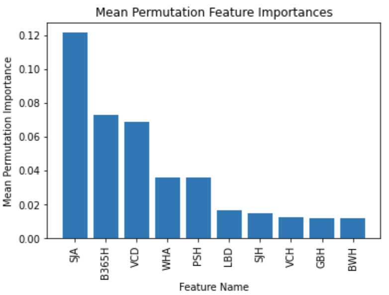

This clues us in to which betting odds providers give more valuable odds when it comes to predicting sports outcomes, and in a way can tell a user which provider to trust. When retraining the logistic using the top $k$ features by importance, we see the following train/test error.

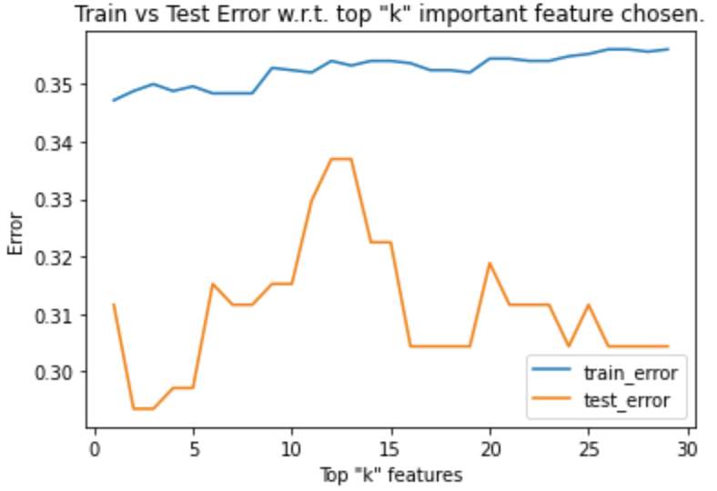

We see that a logistic regression model performs the best when choosing the top 3 or 4 models as it minimizes the test error. Picking the top three features (SJA, B365H, VCD) we get a Jaccard similarity on testing data of 0.707, or 70.7% accuracy in predicting match outcomes! Our RMSE is 0.2935. Train/test error is fairly low, and accuracy is high, so there is good confidence in these results.

It was hypothesized that due to the similar train/test error that the model could be underfitting, so additional feature engineering was attempted through introducing polynomial features. Upon varying the highest degree, we visualized the errors:

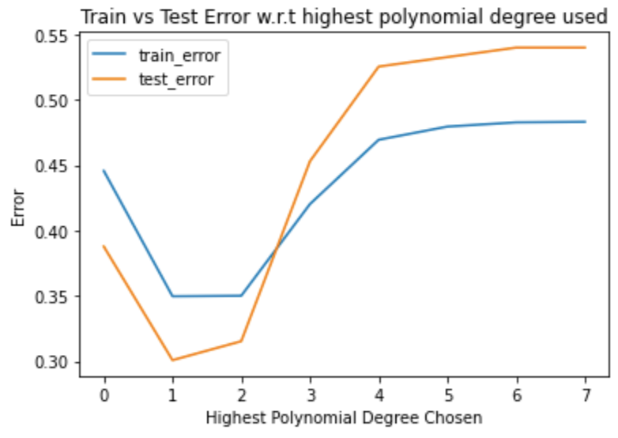

The lowest train and test error are curiously seen at max degree 1, so polynomial features are not the best approach. Ultimately, we settle with a 70% accuracy predictor using logistic regression trained on betting odds data!

#### Team-Based Features

The team-based FIFA attributes are separated into three categories, which have three features each:
1. Build-up Play
    1. buildUpPlaySpeed
    2. buildUpPlayDribbling
    3. buildUpPlayPassing
2. Chance Creation
    1. chanceCreationPassing
    2. chanceCreationCrossing
    3. chanceCreationShooting
3. Defence
    1. defencePressure
    2. defenceAggression
    3. defenceTeamWidth
Each of these features were then aggregated into mean, median, min, and max values per team from the Team_attributes table, as each team has multiple entries in the table. So, we end up with 36 attribute features.

##### Feature Selection and Training by Importance

Initial training on all team-based attribute features yielded the following errors on training and testing data:

| __Metric__ | __Value__ |
| -- | -- |
| Train Error | 0.36822 |
| Test Error | 0.44886 |

This results in a Jaccard index accuracy on the test data of 0.5511, or around 55%, which is lower than the betting odds data. We again evaluate the top ten features by permutation importance and we get:

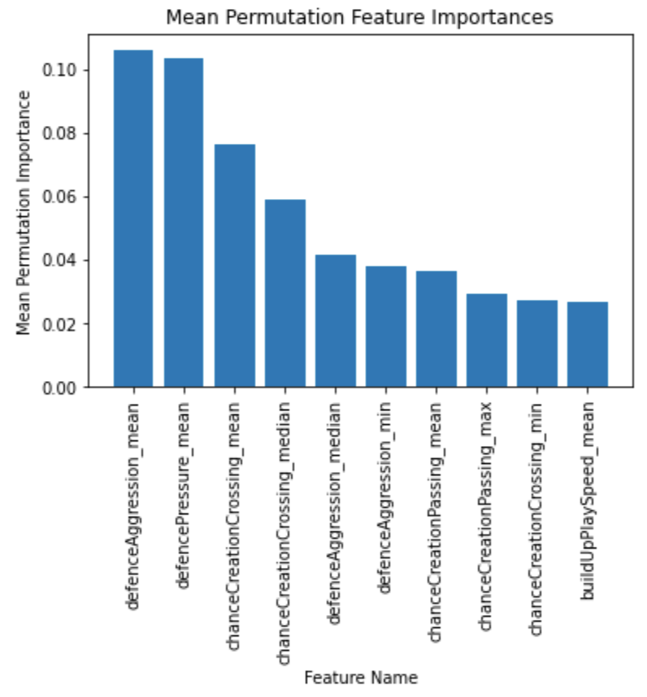

We see that attributes relating to defense and chance creation are much more valuable than build up speed. Performing the same error analysis by varying the top “k” features used in training yields the following plot:

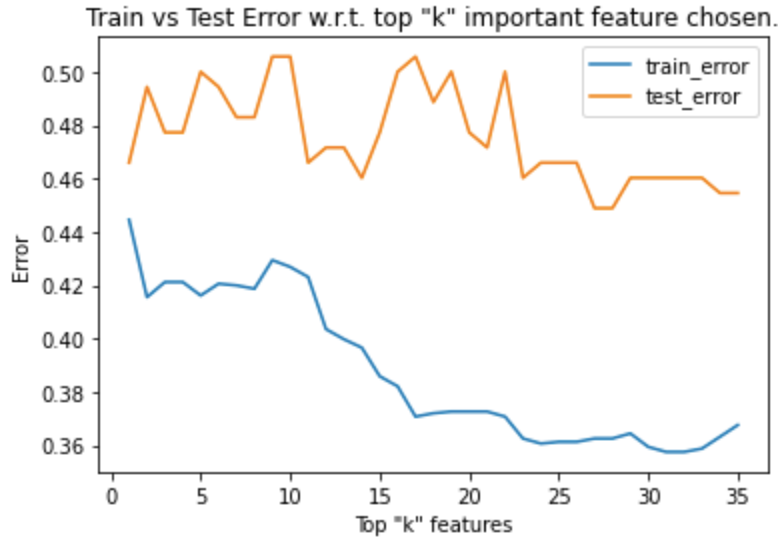

There is much greater fluctuation in test error, although train error decreases sharply (by around 0.08) as more features are chosen. By retraining the model on the top ~25 features which minimizes test error, we get a slight decrease in test error (new error = 0.3625 from old error = 0.3682), a decrease of only 1.55%, which is not significant.

##### By-Category Feature Selection and Training

A more manual feature-selection approach was used to improve the accuracy of the model. Manually training the feature on each individual category yielded the following:

| __Feature Category__ | __Metric__ | __Value__ |
| -- | -- | -- |
| Build-up Play | RMSE on test | 0.42613636363636365 |
| | Accuracy on test | 0.5738636363636364 |
| Chance Creation | RMSE on test | 0.4090909090909091 |
| | Accuracy on test | 0.5909090909090909 |
| Defense | RMSE on test | 0.5113636363636364 |
| | Accuracy on test | 0.48863636363636365 |

Chance creation seems to be the top performing category with a 59% accuracy, a good 4% increase from the previous accuracy score. However, we can do better using the important feature selection metrics. Sorting the chance creation aggregations by importance yields the following:

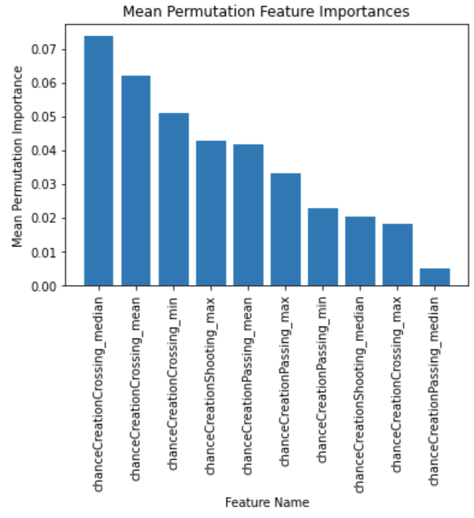

The error fluctuates with respect to the top number of features chosen as follows:

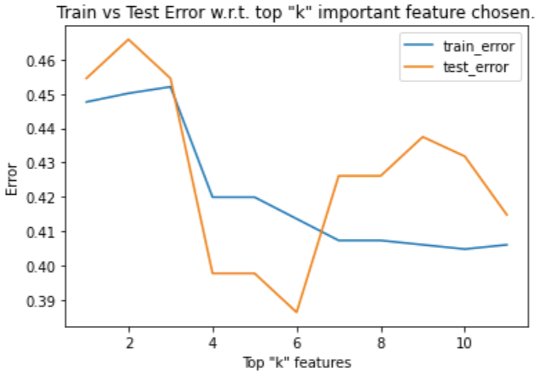

Test error is very clearly minimized using the top 6 features. Retraining the model using the top 6 most important features results in a Jaccard similarity of 0.6134, which tells us we have a 61% accurate logistic regression predictor based solely on the FIFA video game series team aggregate chance creation metrics! We are happy here because our 61% accuracy is sufficient based on our heuristics.

Here is a visualization plotting the top two features against the probability of the match being a home team win:

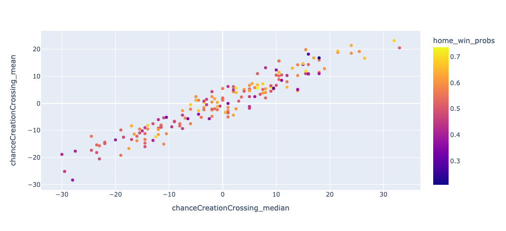

We see that lower probabilities (darker colors) tend towards the left end while higher probabilities (lighter colors) tend towards the right, which is what our logistic regression model is capturing.

#### Player Based Features ####

Given our adoption of a binary approach to results (win vs. loss/draw), we deemed it most fitting to employ a logistic regression model for each of the features under examination. The focus of our analysis was on player-related attributes, specifically player height, weight, overall rating, and potential. To ensure the optimal representation of a team, we calculated the averages of these features per team. This approach was chosen with the expectation that it would yield the most accurate predictions for match outcomes.

While it's plausible to argue for the impact of a "superstar" or players with exceptional talents who might "carry" the team, considering only the highest or top three (arbitrarily chosen) values for each feature, we opted against this approach. This decision was influenced by the already limited number of features and the observed subpar model performance, a matter we will address later on.

The outcomes of the individual features are detailed below:

|           | Height  | Weight  | Rating   | Potential |
|-----------|---------|---------|----------|-----------|
| Estimator | 0.59887 | 0.59887 | 0.627118 | 0.632768  |

Subsequent to these findings, we pondered the notion that the disparity in features between the two teams might hold more significance. In practical terms, considering the height difference between two teams (e.g., 6' players vs. 5' players) could potentially have a more substantial impact than merely assessing the features at "face value" (which would overlook the nuances of a 6' vs. 6' scenario).

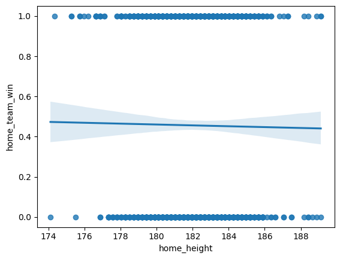
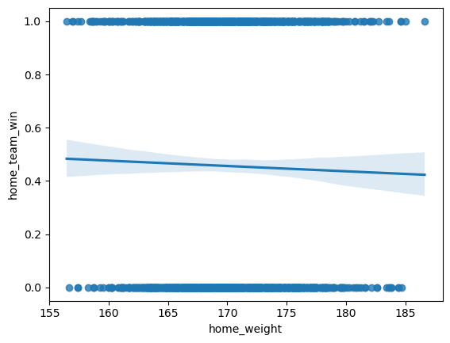
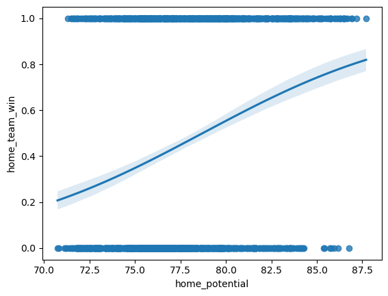
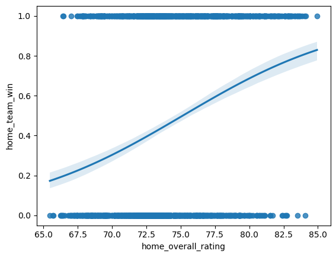

The outcomes for the differences in features are outlined below:

|           | $\Delta$ Height  | $\Delta$ Weight  | $\Delta$ Rating   | $\Delta$ Potential |
|-----------|---------|---------|----------|-----------|
| Estimator | 0.59887 | 0.59887 | 0.610169 | 0.638418  |

Surprisingly, the performance for height, weight, Δ height, and Δ weight were all identical—situated just under the 60% mark, which aligns with our 60% goal but leaves room for improvement. On the other hand, Δ Potential exhibited a performance increase, albeit marginal and practically negligible.

Looking ahead, our strategies to enhance performance include:

Addressing Multicollinearity:
Our initial step toward performance improvement involves mitigating multicollinearity. Given the identical performance of height and weight, we propose removing one or both of these features, considering their lackluster absolute performance. Additionally, we plan to implement a multivariate logistic regression and compare its results with those of a Lasso model, both known for their suitability in low-dimensional datasets. The plan is to systematically remove either height or weight based on a criterion such as the higher root mean square error (RMSE) and assess the impact on logistic regression outcomes.

Regularization of Data:
Given the substantial range and differences in values between height/weight and potential/ratings, regularization becomes imperative. We intend to apply Sci-Kit Learn's MinMaxScaler() function to standardize the data.

Addressing Underfitting:
Given the relatively low performance and comparable results between the test and training sets, treating the model as potentially underfitting is warranted. To address this, we plan to integrate team performance with player performance, thereby augmenting the feature count and potentially alleviating underfitting issues.

### Random Forest Results

#### Betting Odds Features
On initial training with all 30 features (home win, away win, draw odds from 10 providers), we found that the raw accuracy of the Random Forest Classifier was roughly 63%, however it varied anywhere from 60% to 65%. We then used RandomizedSearchCV from sklearn in order to identify the optimal max depth and number of trees in each forest. This not only allowed for greater testing accuracy by increasing the number of trees from the default of 100 to roughly 400, but also decreased the overfitting which was being caused by there being no maximum depth. This led the training accuracy to drop from 100 to around 75, but the test accuracy jumped up to being consistently in the mid 60s (65-67). From these results we created a basic confusion matrix to break down the Random Forests ability to classify True Positives and True Negatives. In the matrix below, the accuracy was .670, the precision was 0.6758, and the recall was .50.
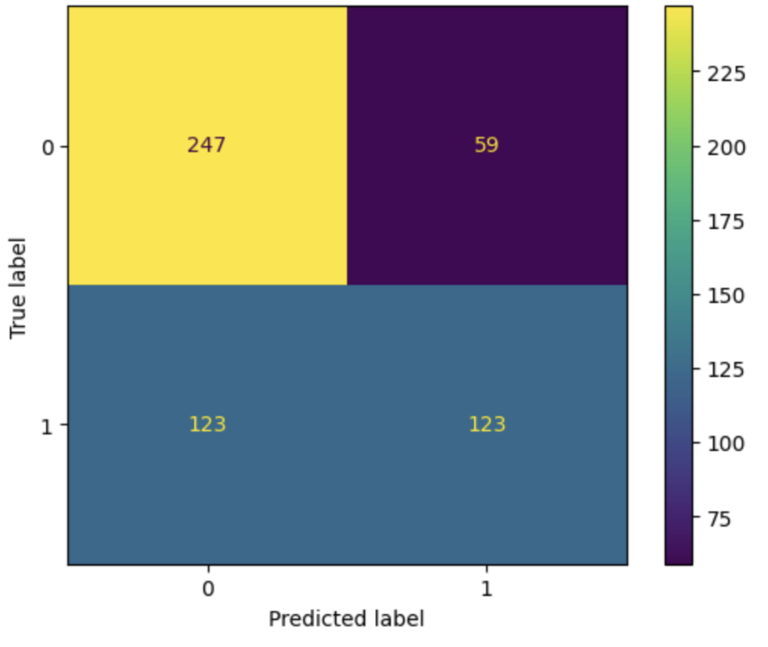

We then found the most important features for the RandomForestClassifier using the feature_importances_ attribute of the RandomForestClassifier. 
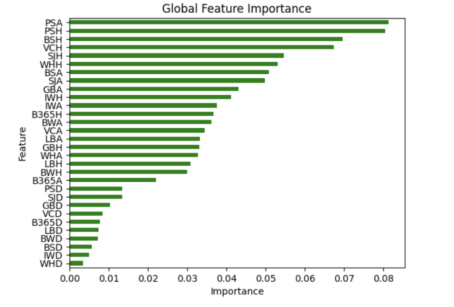

Based on this chart, we decided to test two more times using the top 4 and the top 10 most important features as there seemed to be notable dropoffs in importance after VCH and IWH. When we reran the RandomForestClassifier using just the 4 most important features, we found that the performance remained about the same or marginally worse averaging 65-66% accuracy, however, when running in on the 10 most important features, we found that it actually made the model slightly more successful, hitting 67-68% accuracy consistently.

# Team Attributes Features 
Initially, when using all team attribute features such as build up, chance creation stats, and defense stats, we found that the accuracy was around 57%, ranging from 55% to 60%. However, after fine tuning the parameters such as depth limit and n estimators (the number of trees used), the accuracy increased to be around 59%. As we did in betting odds features, we also used RandomizedSearchCV to determine these features. Through RandomizedSearchCV, we were able to increase the number of trees used to be around 334 and limit the depth to 10, allowing the random forest to result in more accurate predictions. 

After running the model on all the team attribute features, we tried running the model on specific team attributes individually. After running the random forest model on just the build up stats, we had an accuracy of around 55%, but it ranged from 55% to 60%. When we ran the model on just the chance creation stats, we had an accuracy of around 56%, but it ranged from 55% to 60%. And when we ran the model on just the defense stats, we had an accuracy of around 52%, but it ranged from 50% to 55%. We then attempted to optimize our results more through hyper parameter fine tuning on the build up features and the best k features combined and by running the model on just the most important k features for each category. As with finding the most features with the betting odds, using the feature_importances_attribute of the RandomForestClassifier. When we optimized the model to train the random forest by running on the top three features of each category (defense, build up, and chance creation), we had an accuracy of around 62%, but it ranged from 55% to 62%. After hyperparameter fine tuning, we achieved an average accuracy of 60%

Here are the “most important” features chosen that were used for the last optimized random forest model: 
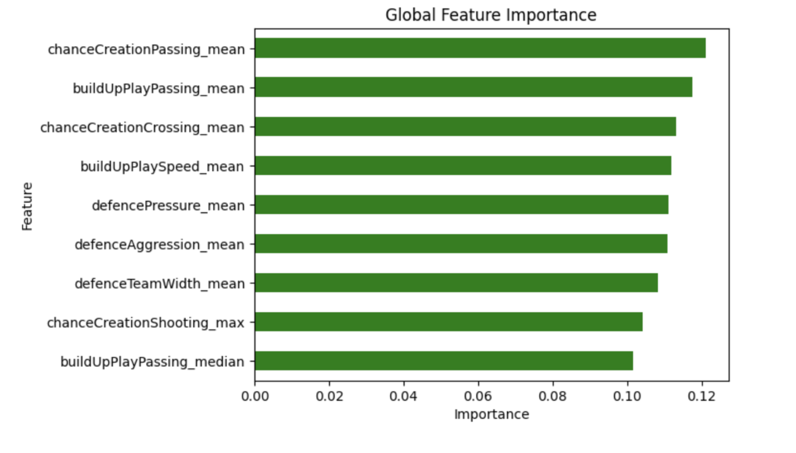

Here is a summary of our findings in this section:

| Attributes | Metric Used | Before HyperParameter Tuning | After HyperParameter Tuning |
|--|--|--|--|
| Betting Odds | Accuracy Score | 63% | 66% |
| Team Attributes | Accuracy Score | 57% | 59% |
| Buildup | Accuracy Score | 50.7% | 56% |

### Neural Network Results
**WIP**

### Conclusions
To conclude, we see the following sufficiently accurate (>60% accuracy) models:
* 70% accurate logistic regression trained on 25 betting odds features
* 61% accurate logistic regression trained on 6 FIFA team chance creation features
* 61% accurate logistic regression trained on 4 player attribute feautres
* 67% accurate random forest classifier trained on 10 betting odds features with optimized hyperparameters
* 60% accurate random forest classifier trained on best 9 team attributes with optimized hyperparameters

## Next Steps
A potential next step for future researchers is investigating how to use the models we built to develop specific spreads and betting odds on matches using the player and team attribute models, and to evaluate their performance against the database betting odds. One way to achieve this would be to perform multi-class classification using cross entropy as the loss function. Then, using the logit, extract probabilities of win/loss/tie, and use the magnitude of each to compute specific spreads using a heuristic, evaluated by trial/error or other metrics. 

## [Timeline](https://gtvault-my.sharepoint.com/:x:/g/personal/sajjan3_gatech_edu/EZLBLWmNKIlOhDSoWb220_8B6iRV6UzX8bXvDjJ6bf01vA?e=dXrga7)
See link above

## Contributors

| Name | Contribution to Midterm |
| -- | -- |
| Daniel | Logistic Regression (historical features)|
| Elijah | Random Forest (betting odds)|
| Sabina | Random Forest (team attributes), neural network |
| Xander | Logistic Regression (regularization) |
| Matthew | Random Forest, Database Feature Extraction |

## References
Horvat, T., & Job, J. (2020). The use of machine learning in sport outcome prediction: A review. WIREs Data Mining and Knowledge Discovery, 10(5). https://doi.org/10.1002/widm.1380

Hubáček, O., Šourek, G., & Železný, F. (2019). Exploiting sports-betting market using machine learning. International Journal of Forecasting, 35(2), 783–796. https://doi.org/10.1016/j.ijforecast.2019.01.001

scikit-learn developers. (n.d.). 4.2. Permutation feature importance — scikit-learn 0.23.1 documentation. Scikit-Learn.org. https://scikit-learn.org/stable/modules/permutation_importance.html

scikit-learn developers. (2014). sklearn.linear_model.LogisticRegression — scikit-learn 0.21.2 documentation. Scikit-Learn.org. https://scikit-learn.org/stable/modules/generated/sklearn.linear_model.LogisticRegression.html

Terrell, E. (2022). Research Guides: Sports Industry: A Research Guide: Soccer. Guides.loc.gov. https://guides.loc.gov/sports-industry/soccer

Wilkens, S. (2021). Sports prediction and betting models in the machine learning age: The case of tennis. Journal of Sports Analytics, 7(2), 1–19. https://doi.org/10.3233/jsa-200463
